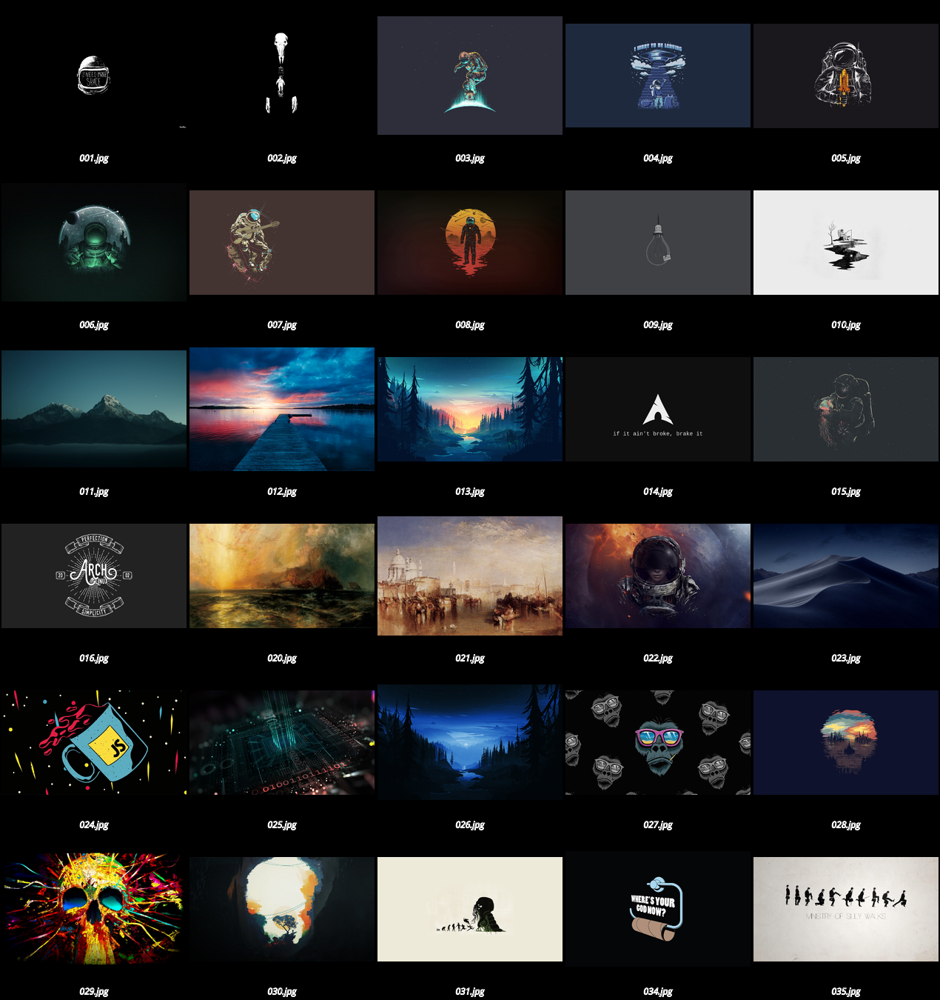

# Wallpaper Collection

**If you find an image hosted in this repository that is yours and of limited use,
please let me know and I will remove it.**

**If you find an image hosted in this repository and you know the author please
let me know so I can give the proper attribution.**

## Ownership

Here are the image credits that I'm aware of:

- [011.jpg](011.jpg): Photo by [Daniel Leone](https://unsplash.com/@danielleone?utm_source=unsplash&amp;utm_medium=referral&amp;utm_content=creditCopyText) on [Unsplash](https://unsplash.com/s/photos/wallpaper?utm_source=unsplash&amp;utm_medium=referral&amp;utm_content=creditCopyText)
- [012.jpg](012.jpg): Photo by [Anders Jildén](https://unsplash.com/@andersjilden?utm_source=unsplash&utm_medium=referral&utm_content=creditCopyText) on [Unsplash](https://unsplash.com/s/photos/wallpaper?utm_source=unsplash&utm_medium=referral&utm_content=creditCopyText)
- [013.jpg](013.jpg): [Mikael Gustafsson](https://www.instagram.com/mklgustafsson/) (Also he has animated gif)
- [014.jpg](014.jpg): From [GetWallpapers](http://getwallpapers.com/collection/arch-linux-wallpaper)
- [016.jpg](016.jpg): From [GetWallpapers](http://getwallpapers.com/collection/arch-linux-wallpaper)
- [020.jpg](020.jpg): [Thomas Moran](https://en.wikipedia.org/wiki/Thomas_Moran) - [Fiercely the red sun descending/Burned his way along the heavens](https://ncartmuseum.org/art/detail/fiercely_the_red_sun_descending_burned_his_way_along_the_heavens)
- [021.jpg](021.jpg): [J. M. W. Turner](https://en.wikipedia.org/wiki/J._M._W._Turner) - [Palazzo ducale](https://commons.wikimedia.org/wiki/File:Joseph_Mallord_William_Turner_094.jpg)
- [023.jpg](023.jpg): [Mojave Desert]()
- [024.jpg](024.jpg): 
- [025.jpg](025.jpg): [wallhaven](https://wallhaven.cc/w/z87ppg)
- [026.jpg](026.jpg): [wallpapercave](https://wallpapercave.com/w/wp4870590)

## Collage

The collage is generated with [imagemagick](https://imagemagick.org/) and the script `generate_collage.sh`.
